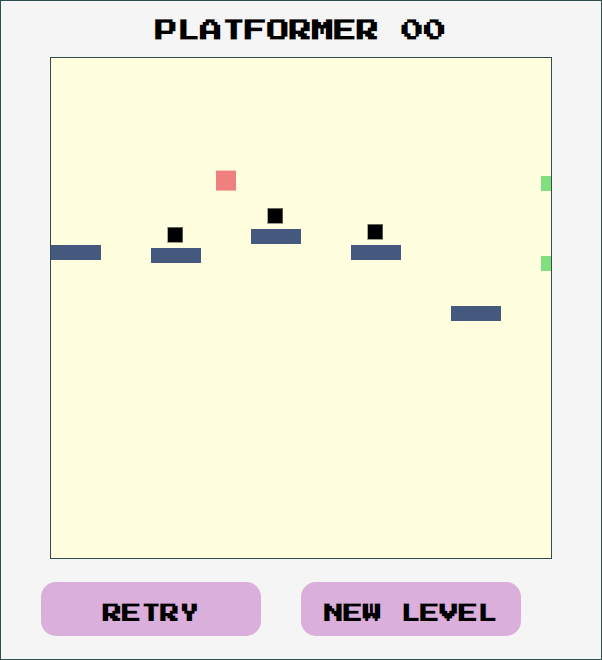
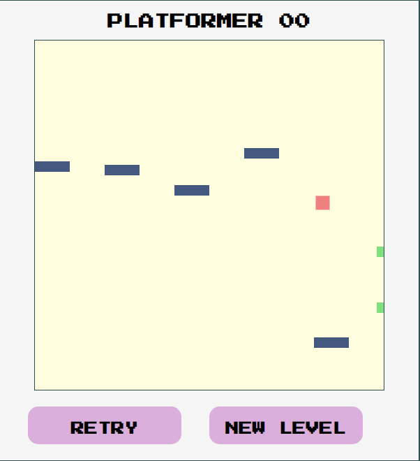
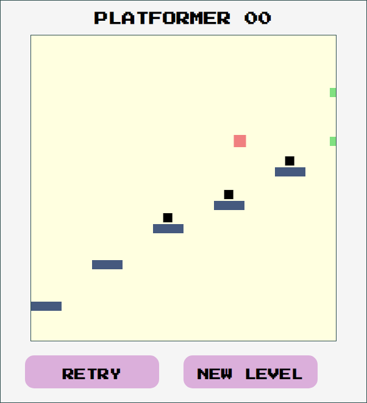
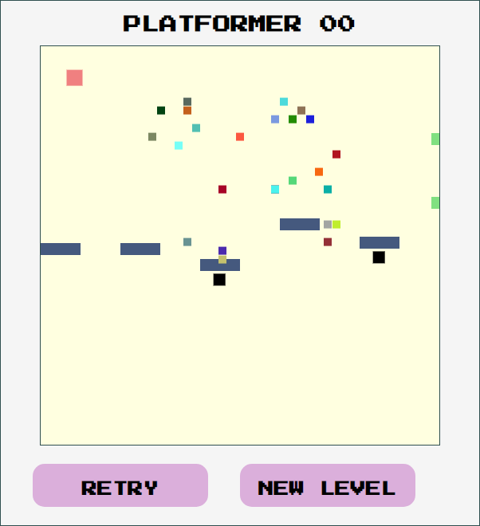

# Platformer 00 🕹

## Background

I wanted to try making a game with an event loop and basic physics.  
I used [this tutorial](https://www.educative.io/edpresso/how-to-make-a-simple-platformer-using-javascript) to create the basic game, then I added some elements of my own.  
You can play the game [here](https://devarrowsmith.github.io/platformer-00/).

---

## Controls
- Jump: Up arrow key
- Move left/right: Left/right arrow keys

---

## Motivation

Having read about event loops in JavaScript I thought it would be fun to try one out. This was an opportunity to try some new algorithms, think about event sequence and create my first platform game. 

I aimed to:
- Create a platform game
- Use an event loop to create a continuously responsive interface
- Practice conditional methods
- Implement some simple physics
- Use JavaScript, HTML and CSS in a different context

---

## Screenshots

---

## Installation

The game is hosted on [Github Pages](https://devarrowsmith.github.io/platformer-00/) and can be run from there.

To run the game locally:
1. [Clone this repo](https://github.com/DevArrowsmith/platformer-00) (Here's [a guide on cloning repos](https://docs.github.com/en/enterprise/2.13/user/articles/cloning-a-repository)).
2. Navigate to index.html within the cloned directory. Open this in a browser.

---

## Framework

Built with JavaScript and HTML.
Styled with CSS.

---

## Next Steps
- Show the controls in the game window.
- The app doesn't work on mobile devices. it could be rescaled with media queries to permit this. I'm not sure how to add touch controls to a game, but I can find out!
- It would be nice to add some extra graphics that show on key events, like falling and enemy collisions.
- Add more enemy types. Ideas include...
  - Ziggy: Moves left and right over a platform
  - Tag: Follows the player's x-location but is confined to a platform
  - Buzzy: Slowly floats towards the player. Not confined to platforms
  - Spacey: Orbits a platform
  - Sentry: Fires small projectiles at the player, but only shoots from right to left. Bound to the leftmost edge of a platform
- Add a difficulty controller that modifies the number and type of enemies generated.
- Add a tracker that shows how many wins and losses you've had.

---

## Credits

The core of this game (the canvas, player character, controls, platform generation and jump physics) were produced using a tutorial provided by the team at [Edpresso](https://www.educative.io/edpresso/how-to-make-a-simple-platformer-using-javascript). Additional elements were created by myself.